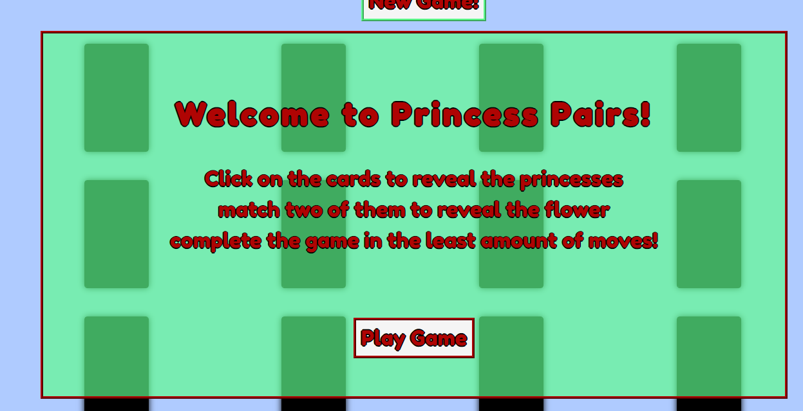
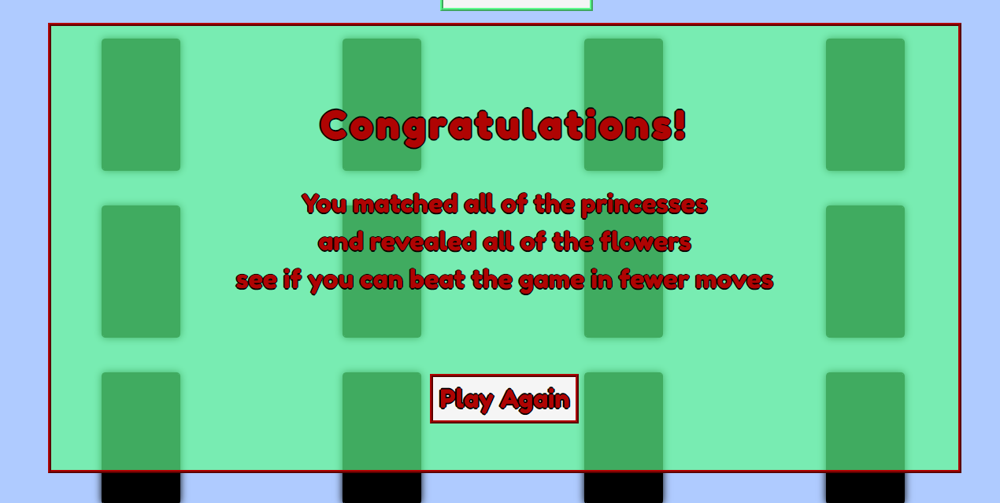
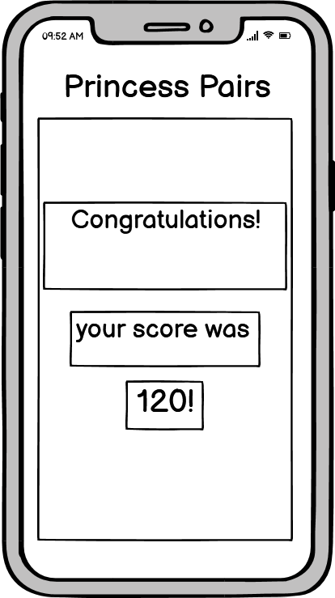

# Princess Pairs
## Card matching game

Princess Pairs is a website where you can play a card matching game. On page load the princess cards fade to black and there is a modal with simple instructions on how to play the game. There is a move counter at the bottom of the page that remembers your lowest move tally. When a princess is matched the card reveals a flower and when all princesses are found a modal appears congratulating you and asks if you want to try and beat your move tally.

The primary goal of the website is to provide a simple fun game to play for children.

## Existing features

### Main header

 * Shows title of page in a clear way matching the colour scheme of the website.
 * Has a new game button incorporated into it that lets the user reset the game area.
 * The font used matches the rest of the font used throughout the website.

 

### Modal on page load

 * The modal that appears on page load has a welcome message and the rules of the game.
 * The font and the colours used match the rest of the website.
 * There is a play game button that removes the modal and allows the user to play the game.

 

### Game area 

 * Here is a picture of the game area with the card faces hidden, There is a total of nine princesses to match up.
 * When a card is clicked the princesses fade into view.
 * If there is no match when two cards are clicked then the cards fade back to black.
 * When two princesses are matched the card shows a flower.

 

### Different card faces

 * Here is a picture of the different card states during the game

 

### Score area

 * The score area at the bottom of the page has a moves counter and a best result/highscore counter.
 * The move counter increases when two cards are clicked.
 * The best score counter stores the users' score that has been completed in the fewest attempts.

 

### Final modal when game complete

 * This is the modal that appears when all cards are matched.
 * There is a message congratulating the player and asks them to play again.

 

## Potential future features

 * Ability to customise your own colour scheme on the site for the cards and playing area when you beat the game a certain number of times.
 * Depending on screen size increase or decrease difficulty by changing the number of cards played with.

## Wireframes

 ### Below are the wireframes that I used to begin the design process for the website

 * This is the wireframe for the landing page with the modal.

 
 
 

 * This is the wireframe of the game area

 
 
 

 * This is the wireframe of the final score page with modal

 
 
 

## Design choices

When coming up with the idea for the site I was wanting to make a game that my young daughter would enjoy playing. When choosing the colours I was wanting pastel shades and I kept the colours to only a few so the site has a consistent theme throughout.

## Testing

 I tested the site using the jigsaw css validater, the w3c html validater and jshint. Any errors have been fixed in the code.

 * CSS validated code

 

 * HTML validated code

 

I also tested the site using Lighthouse part of the dev tools in Google chrome browser.

 

I also used the website [Am I responsive](https://ui.dev/amiresponsive) to check the responsive design of the site the image is at the top of the readme file.

## Debugging 

 * I deployed my site to GitHub pages early on to be able to test my site throughout the process of building the site.
 * I found that a user could click the same card twice to flip it over so added code to stop this from happening.
 * When running lighthouse testing the accessibility score was not 100% so I updated the red colour I was using to remedy this.
 * I have tested my site extensively to ensure no issues remain.

## Deployment

  The site is deployed here https://carl2087.github.io/princess-pairs/
  
  I followed the steps below to deploy my website.

  1. Log into GitHub.
  2. Select the project repsitory I want to deploy.
  3. Select settings in the above menu.
  4. Select pages in the left hand side menu.
  5. In the source section, select branch Master and save.
  6. The page will produce the website URL that links to the site.

## Credits

### Code

 * General code queries and issues were researched and answered with [W3 Schools](https://www.w3schools.com/) and [Stack Overflow](https://stackoverflow.com/) also [Codepen](https://codepen.io/trending)
 * I used the material that was used in the code institute course to help write my code for the site.

 ### Media

 * The pictures used for the princesses are royalty free from [Pixabay](https://pixabay.com/vectors/princess-crown-kingdom-dress-queen-1224654/)
 * The Flowers used are royalty free from here [Pixabay](https://pixabay.com/vectors/flower-flowers-bloom-plant-white-168974/)
 * As the princesses were royalty free i did edit the to increase the colour count for the site.

### Acknowledgements

I would like to thank my mentor Victor Miclovich who has given me great advice and is very clear in explaining processes. I would also like to thank the Code Institute Slack community who are always ready to help if needed. Also the code institute slack community who are great and there is always someone ready to help if you are stuck or just to pick you up if you're feeling under the pressure.

